# World Population Report (SET09803 – Group 13)

<p align="left">
  <!-- CI (GitFlow branches) -->
  <a href="https://github.com/napier-devops-group13/world-population-report/actions/workflows/ci.yml?query=branch%3Amaster">
    
  </a>
  <a href="https://github.com/napier-devops-group13/world-population-report/actions/workflows/ci.yml?query=branch%3Adevelop">
    
  </a>

  <!-- Coverage (master) -->
  <a href="https://app.codecov.io/gh/napier-devops-group13/world-population-report">
    
  </a>

  <!-- Release + License + Tech -->
  <a href="https://github.com/napier-devops-group13/world-population-report/releases/latest">
    
  </a>


  <a href="LICENSE">
    
  </a>
  
  
</p>


REST API coursework for **SET09803** using the classic MySQL **`world`** dataset.  
The project is built to be **CI-friendly**, **Dockerised**, and aligned with the **Code Review 1**, **Code Review 2**, and **Final Delivery** marking criteria.

Currently the project:

- Implements the **Country Reports R01–R06** end-to-end (SQL ➜ Javalin ➜ JSON ➜ CSV evidence).
- Provides a reproducible stack using **Docker Compose** (MySQL 8.4 + app).
- Runs via **Maven** with unit + integration tests, JaCoCo coverage, Checkstyle and SpotBugs.
- Integrates with **GitHub Actions** (build, tests, coverage upload, Docker smoke test).
- Uses a **GitFlow**-style workflow (`master`, `develop`, `release/*`) with PR templates, issue templates, CODEOWNERS and a Code of Conduct.

---

## Table of Contents

- [Quick Start](#quick-start)
- [API Endpoints — Countries (R01–R06)](#api-endpoints--countries-r01r06)
- [API Endpoints — Capital (R17–R22)](#api-endpoints--capital-r17r22)
- [Testing & Coverage](#testing-&-coverage)
- [Report Evidence for R01–R06](#report-evidence-for-r01r06)
- [Database & Seeding](#database--seeding)
- [Project Structure](#project-structure)
- [Quality & CI/CD](#quality--cicd)
- [Functional Requirements (R01–R32)](#functional-requirements-r01r32)
- [Assessment Evidence (CR1 / CR2 / Final)](#assessment-evidence-cr1--cr2--final)
- [Team](#team)
- [License](#license)

---

## Quick Start

> **Requirements:** JDK 21+, Maven 3.9+, Docker Desktop

### Full stack via Docker Compose (recommended for demo)

```bash
# from repo root
docker compose up -d
# db  -> MySQL 8.4 with 'world' schema
# app -> Javalin API on http://localhost:7070
```
---

## Testing & Coverage

We separate fast unit tests from integration tests.

### Unit tests

- `AppRoutesTest` exercises all HTTP routes in `App` using an in-memory `FakeCountryRepo`.
  - Introduced a `CountryRepository` interface for the country reports (R01–R06).
  - `WorldRepo` implements this interface in production.
  - The test verifies:
    - `/health` returns `200 OK`.
    - All `/countries/...` and `/countries/.../top/{n}` routes return JSON.
    - `?sort=pop` selects the population-sorted variants.
    - Invalid `n` (`0` or non-numeric) returns HTTP `400` with a clear JSON error.
    - Unexpected failures in the repository are mapped to HTTP `500` (`internal server error`).

Other unit tests:
- `ComparatorsTest` – checks sorting behaviour for country reports.

These tests run with:

```bash
mvn test
```
---

## API Endpoints – Cities (R07–R16)

**Base URL:**

- Local JVM (IntelliJ / `java -jar`): `http://localhost:7070/api`
- Docker (`docker-compose up -d`): `http://localhost:7080/api`

City report responses use the **City report shape**:

- `name` – city name
- `country` – country name
- `district` – district name
- `population` – city population (integer)

| ID  | Method | Endpoint                                      | Description                                                                                  |
|-----|--------|-----------------------------------------------|----------------------------------------------------------------------------------------------|
| R07 | GET    | `/cities/world`                              | All cities in the world, ordered by **population DESC**.                                     |
| R08 | GET    | `/cities/continent/{continent}`              | All cities in a continent, ordered by **population DESC**.                                   |
| R09 | GET    | `/cities/region/{region}`                    | All cities in a region, ordered by **population DESC**.                                      |
| R10 | GET    | `/cities/country/{country}`                  | All cities in a country, ordered by **population DESC**.                                     |
| R11 | GET    | `/cities/district/{district}`                | All cities in a district, ordered by **population DESC**.                                    |
| R12 | GET    | `/cities/world/top`                          | Top-N cities in the world by population (largest → smallest). Uses query param `?n={n}`.     |
| R13 | GET    | `/cities/continent/{continent}/top`          | Top-N cities in a continent by population. Uses query param `?n={n}`.                        |
| R14 | GET    | `/cities/region/{region}/top`                | Top-N cities in a region by population. Uses query param `?n={n}`.                           |
| R15 | GET    | `/cities/country/{country}/top`              | Top-N cities in a country by population. Uses query param `?n={n}`.                          |
| R16 | GET    | `/cities/district/{district}/top`            | Top-N cities in a district by population. Uses query param `?n={n}`.                         |

**Query parameter for Top-N endpoints:**

- `n` (required for R12–R16 when called externally; default is `10` if omitted in internal usage)
  - Example: `/cities/world/top?n=5`
  - Example: `/cities/continent/Asia/top?n=5`

**Error handling (examples):**

- Missing or invalid `n` (e.g. not a number) → **HTTP 400** with plain-text message  
  `n must be an integer`

- `n <= 0` → **HTTP 400** with plain-text message  
  `n must be a positive integer`

- Unknown `continent` / `region` / `country` / `district` → **HTTP 200** with an empty JSON array `[]`  
  (no matching cities in the world database).


---

## Database & Seeding

- **Image:** `mysql:8.4`
- **Service name (compose):** `db`
- **Schema:** classic *world* dataset.
- **Seed file:** `db/init/01-world.sql` mounted into the container.

`docker-compose.yml` exposes:

- MySQL container port `3306` → host port `43306`.
- App container port `7070` → host port `7080` (used by the Docker smoke test and browser).

## Application database configuration

Defaults for local development (running the app directly from IntelliJ/Maven) are in  
`src/main/resources/application.properties`:

```properties
port=7070

DB_HOST=localhost
DB_PORT=43306
DB_NAME=world
DB_USER=app
DB_PASS=app
```

---

## Project Structure – City Reports (R07–R16)

| Path                                                                 | Purpose                                                                                             |
|----------------------------------------------------------------------|-----------------------------------------------------------------------------------------------------|
| `src/main/java/com/group13/population/App.java`                      | Javalin bootstrap; registers **country** and **city** routes and exposes `/health`.                |
| `src/main/java/com/group13/population/db/Db.java`                    | MySQL JDBC helper used by repositories and integration tests.                                      |
| `src/main/java/com/group13/population/model/City.java`              | Domain model representing a city row (name, country, district, population).                        |
| `src/main/java/com/group13/population/model/CityRow.java`           | Lightweight projection used by JDBC to map city query results for R07–R16.                         |
| `src/main/java/com/group13/population/repo/CityRepo.java`           | Repository interface describing the city reports (R07–R16).                                        |
| `src/main/java/com/group13/population/repo/CityWorldRepo.java`      | JDBC implementation of `CityRepo` with SQL for world/continent/region/country/district queries.   |
| `src/main/java/com/group13/population/service/CityService.java`     | Service layer: wraps `CityRepo`, validates inputs, returns city report rows.                       |
| `src/main/java/com/group13/population/web/CityRoutes.java`          | REST endpoints under `/api/cities/...` implemented with Javalin (R07–R16).                         |
| `src/test/java/com/group13/population/db/DbTest.java`               | Unit tests for `Db` (JDBC URL formatting and failure behaviour).                                   |
| `src/test/java/com/group13/population/db/DbIT.java`                 | Integration test for `Db.connect(..)` against the real MySQL `world` database.                     |
| `src/test/java/com/group13/population/model/CityTest.java`          | Unit tests for `City` (constructor, getters, equality, `toString`).                                |
| `src/test/java/com/group13/population/repo/CityWorldRepoIT.java`    | Integration tests for `CityWorldRepo` using the real `world` schema (R07–R16 SQL correctness).     |
| `src/test/java/com/group13/population/service/CityServiceTest.java` | Unit tests for `CityService` covering all R07–R16 service methods.                                 |
| `src/test/java/com/group13/population/web/CityRoutesTest.java`      | Route tests calling `/api/cities/...` and asserting HTTP status + JSON shape.                      |
| `src/test/java/com/group13/population/web/CityReportsOrderingTest.java` | Extra checks that city reports are ordered by population DESC (and name as a tie-break).     |
| `src/test/java/com/group13/population/web/AppSmokeTest.java`        | Smoke test that the Javalin app starts and stops cleanly with all routes registered.               |
| `db/init/01-world.sql`                                              | Seed script for the MySQL `world` schema used by Docker and integration tests.                     |
| `docs/evidence/*.csv` / `*.png` (R07–R16)                           | Captured outputs (CSV + screenshots) for the city reports (Name, Country, District, Population).   |
| `docs/evidence/generate-city-reports.ps1`                           | Helper script to call the `/api/cities/...` endpoints and regenerate evidence CSV files R07–R16.   |
| `docs/evidence/verify-city-reports.ps1`                             | PowerShell helper that verifies R07–R16 endpoints respond correctly on port 7080.                  |


---


## Quality & CI/CD

- **CI triggers on:** pushes and PRs to `master`, `develop`, and `release/*`.

- **Build & test:**
  - Uses a Temurin JDK in CI (Maven compiler targets Java 21).
  - Spins up a MySQL service and seeds the `world` database from `db/init/01-world.sql`.
  - Runs unit tests and integration tests (`mvn verify` with Surefire + Failsafe).
  - Publishes the shaded JAR from `target/world-population-report-*-shaded.jar` as an artifact.

- **Coverage:**
  - JaCoCo runs as part of the Maven build.
  - Coverage is uploaded to **Codecov**, which feeds the coverage badge in the README.

- **Static analysis:**
  - Checkstyle (Google-style configuration) and SpotBugs run as part of the Maven build.

- **Docker smoke test:**
  - Builds the Docker image for the app.
  - Runs the container alongside a MySQL service (same configuration as `docker-compose.yml`).
  - Verifies `GET /api/countries/world` on the running container returns HTTP `200`.


---

## Functional Requirements (R01–R32)

### Summary of the coursework functional requirements and current implementation status

> **Count:** 22 / 32 requirements implemented (all **Country** reports R01–R06, all **City** reports R07–R16, and all **Capital City** reports R17–R22) → **68.75%**.

| ID  | Name                                                                                           |   Met   | Screenshot                                                                                                                | CSV file                                                                  |
|-----|------------------------------------------------------------------------------------------------|:-------:|---------------------------------------------------------------------------------------------------------------------------|---------------------------------------------------------------------------|
| R01 | All the countries in the world organised by largest population to smallest.                    | ✅ Yes  |                                                | [R01_world.csv](docs/evidence/R01_world.csv)                             |
| R02 | All the countries in a continent organised by largest population to smallest.                  | ✅ Yes  |                                       | [R02_continent_Asia.csv](docs/evidence/R02_continent_Asia.csv)           |
| R03 | All the countries in a region organised by largest population to smallest.                     | ✅ Yes  |                                   | [R03_region_EasternAsia.csv](docs/evidence/R03_region_EasternAsia.csv)   |
| R04 | The top N populated countries in the world where N is provided by the user.                    | ✅ Yes  |                                           | [R04_world_top5.csv](docs/evidence/R04_world_top5.csv)                   |
| R05 | The top N populated countries in a continent where N is provided by the user.                  | ✅ Yes  |                                  | [R05_continent_Asia_top5.csv](docs/evidence/R05_continent_Asia_top5.csv) |
| R06 | The top N populated countries in a region where N is provided by the user.                     | ✅ Yes  |                              | [R06_region_EasternAsia_top5.csv](docs/evidence/R06_region_EasternAsia_top5.csv) |
| R07 | All the cities in the world organised by largest population to smallest.                       | ✅ Yes  | 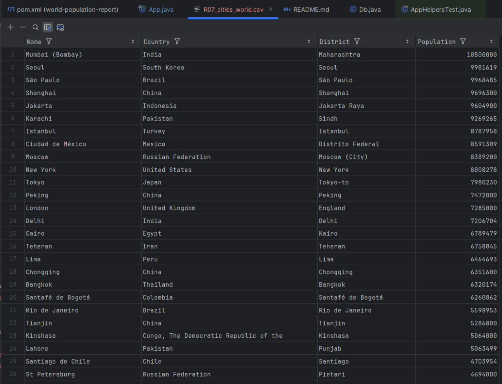                                        | [R07_cities_world.csv](docs/evidence/R07_cities_world.csv)               |
| R08 | All the cities in a continent organised by largest population to smallest.                     | ✅ Yes  | 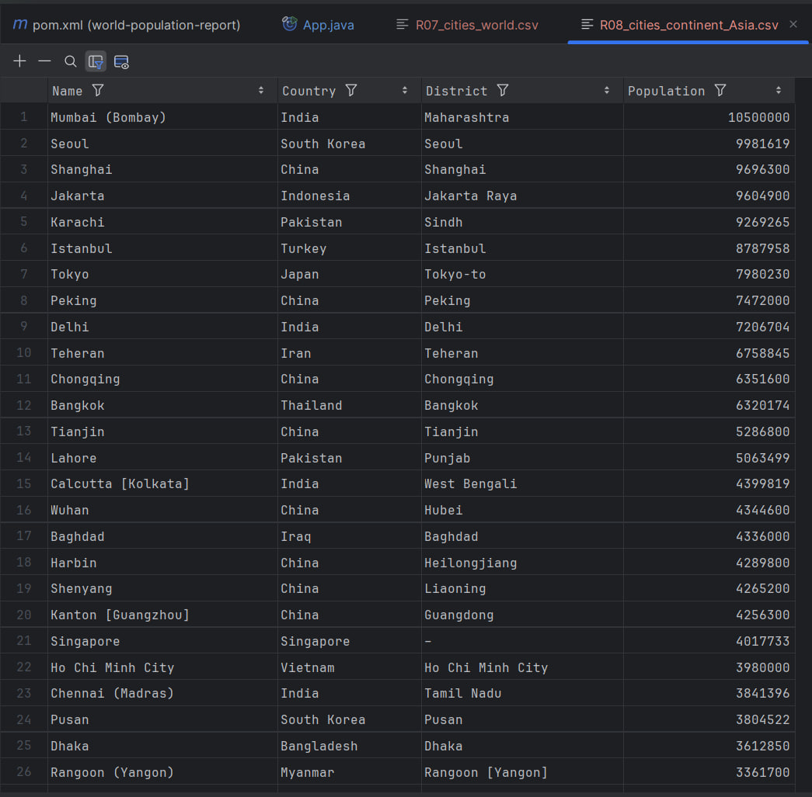                               | [R08_cities_continent_Asia.csv](docs/evidence/R08_cities_continent_Asia.csv) |
| R09 | All the cities in a region organised by largest population to smallest.                        | ✅ Yes  | 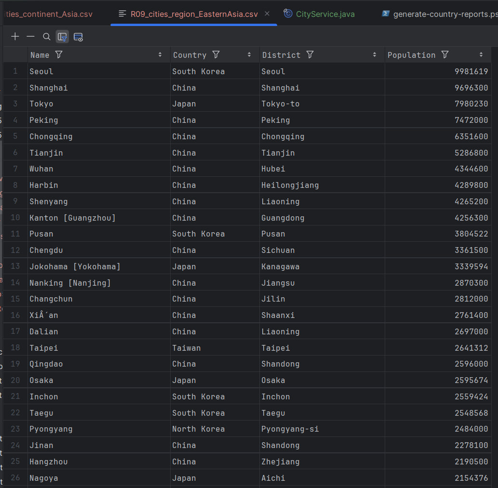                           | [R09_cities_region_EasternAsia.csv](docs/evidence/R09_cities_region_EasternAsia.csv) |
| R10 | All the cities in a country organised by largest population to smallest.                       | ✅ Yes  | 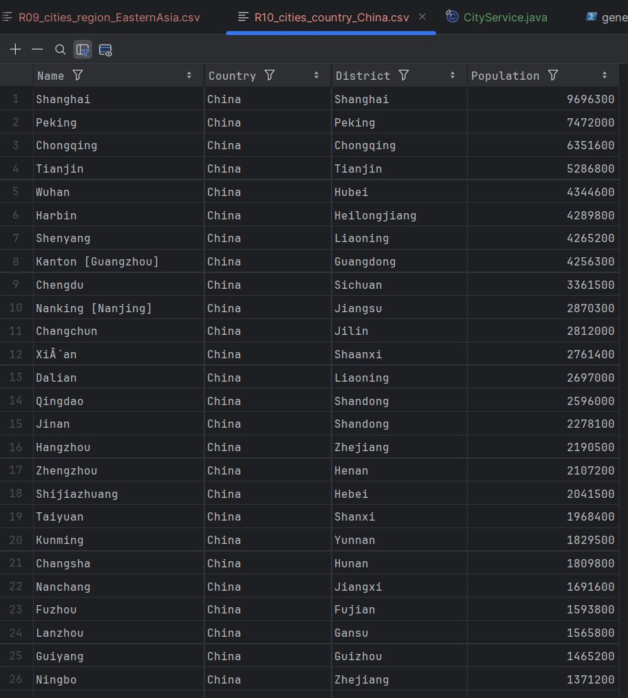                                | [R10_cities_country_China.csv](docs/evidence/R10_cities_country_China.csv) |
| R11 | All the cities in a district organised by largest population to smallest.                      | ✅ Yes  | 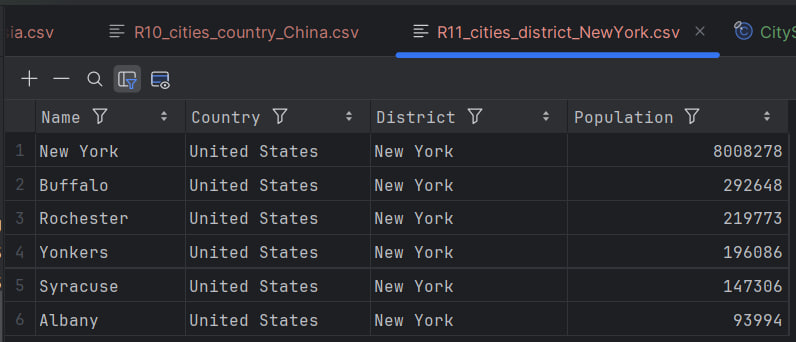                             | [R11_cities_district_NewYork.csv](docs/evidence/R11_cities_district_NewYork.csv) |
| R12 | The top N populated cities in the world where N is provided by the user.                       | ✅ Yes  | 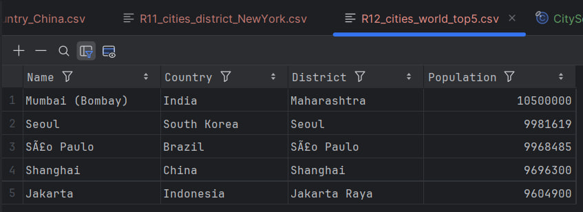                                   | [R12_cities_world_top5.csv](docs/evidence/R12_cities_world_top5.csv)     |
| R13 | The top N populated cities in a continent where N is provided by the user.                     | ✅ Yes  | 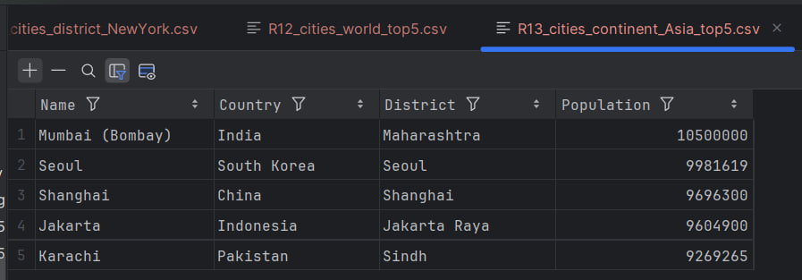                          | [R13_cities_continent_Asia_top5.csv](docs/evidence/R13_cities_continent_Asia_top5.csv) |
| R14 | The top N populated cities in a region where N is provided by the user.                        | ✅ Yes  | 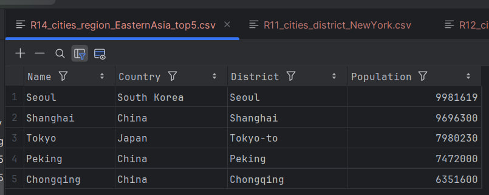                      | [R14_cities_region_EasternAsia_top5.csv](docs/evidence/R14_cities_region_EasternAsia_top5.csv) |
| R15 | The top N populated cities in a country where N is provided by the user.                       | ✅ Yes  | 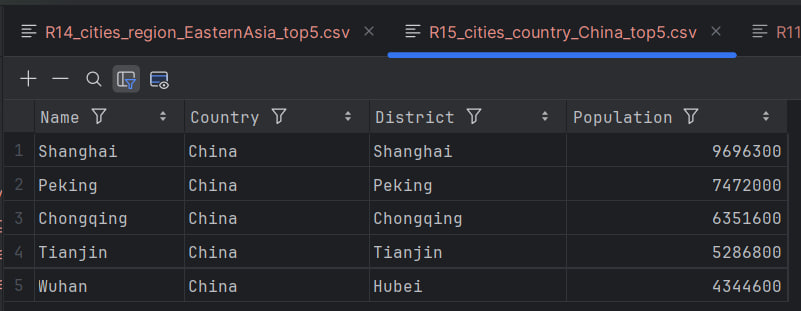                           | [R15_cities_country_China_top5.csv](docs/evidence/R15_cities_country_China_top5.csv) |
| R16 | The top N populated cities in a district where N is provided by the user.                      | ✅ Yes  | 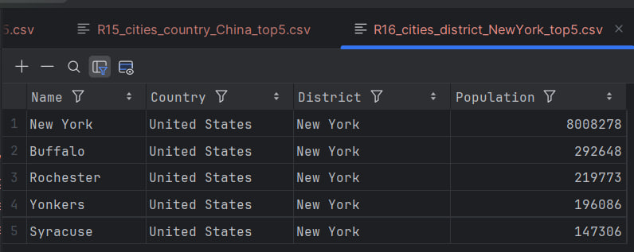                        | [R16_cities_district_NewYork_top5.csv](docs/evidence/R16_cities_district_NewYork_top5.csv) |
| R17 | All the capital cities in the world organised by largest population to smallest.               | ✅ Yes  | 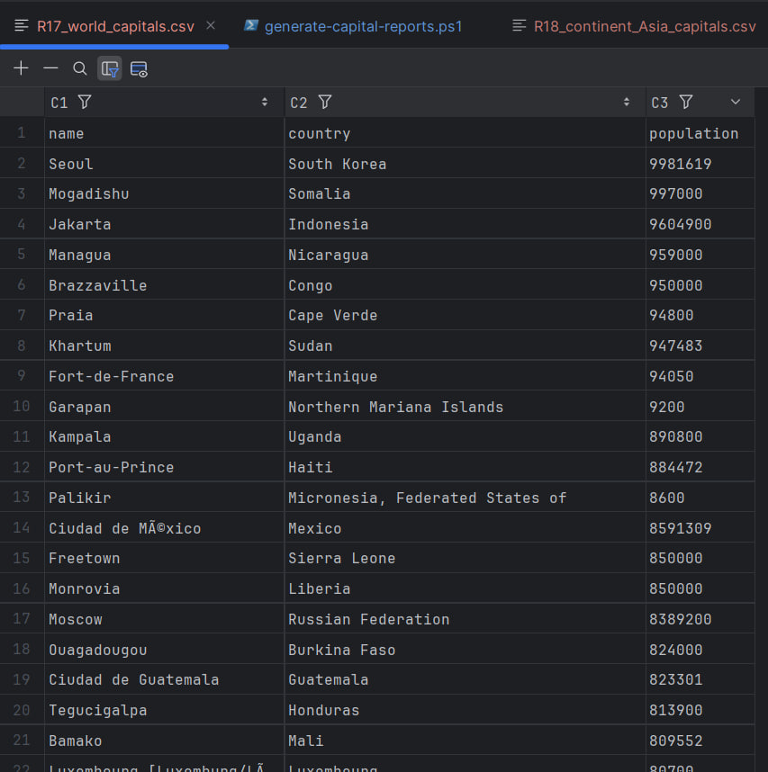                                      | [R17_world_capitals.csv](docs/evidence/R17_world_capitals.csv)           |
| R18 | All the capital cities in a continent organised by largest population to smallest.             | ✅ Yes  | 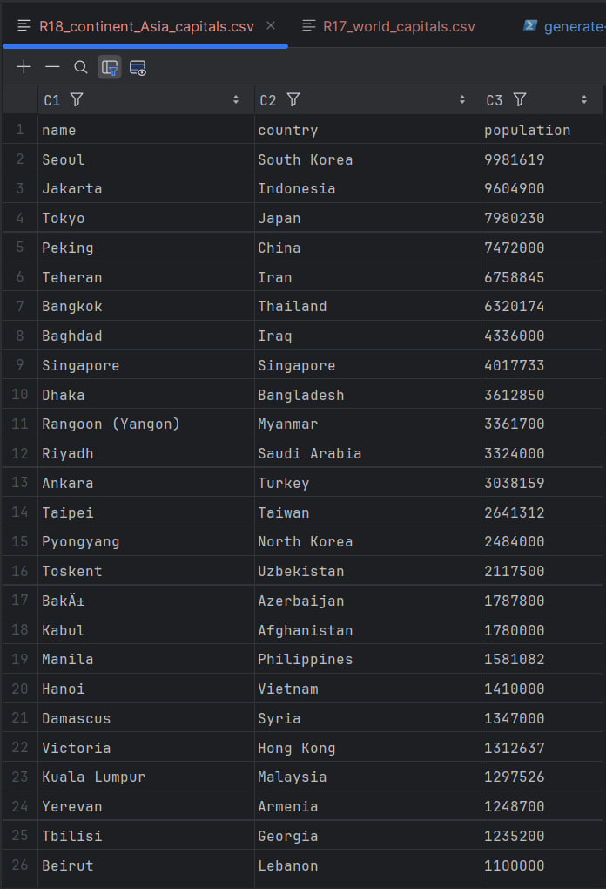                             | [R18_continent_Asia_capitals.csv](docs/evidence/R18_continent_Asia_capitals.csv) |
| R19 | All the capital cities in a region organised by largest population to smallest.                | ✅ Yes  | 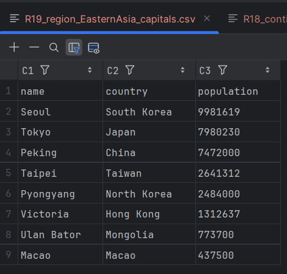                         | [R19_region_EasternAsia_capitals.csv](docs/evidence/R19_region_EasternAsia_capitals.csv) |
| R20 | The top N populated capital cities in the world where N is provided by the user.               | ✅ Yes  | 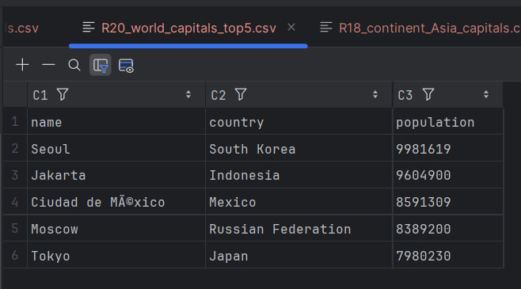                                 | [R20_world_capitals_top5.csv](docs/evidence/R20_world_capitals_top5.csv) |
| R21 | The top N populated capital cities in a continent where N is provided by the user.             | ✅ Yes  | 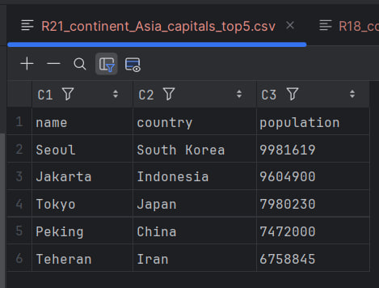                        | [R21_continent_Asia_capitals_top5.csv](docs/evidence/R21_continent_Asia_capitals_top5.csv) |
| R22 | The top N populated capital cities in a region where N is provided by the user.                | ✅ Yes  | 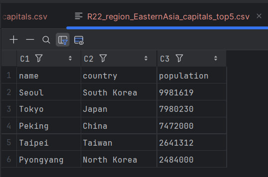                    | [R22_region_EasternAsia_capitals_top5.csv](docs/evidence/R22_region_EasternAsia_capitals_top5.csv) |
| R23 | Population of people, in cities and not in cities, for each continent.                         | ❌ No   | –                                                                                                                         | –                                                                         |
| R24 | Population of people, in cities and not in cities, for each region.                            | ❌ No   | –                                                                                                                         | –                                                                         |
| R25 | Population of people, in cities and not in cities, for each country.                           | ❌ No   | –                                                                                                                         | –                                                                         |
| R26 | The population of the world.                                                                    | ❌ No   | –                                                                                                                         | –                                                                         |
| R27 | The population of a continent.                                                                  | ❌ No   | –                                                                                                                         | –                                                                         |
| R28 | The population of a region.                                                                     | ❌ No   | –                                                                                                                         | –                                                                         |
| R29 | The population of a country.                                                                    | ❌ No   | –                                                                                                                         | –                                                                         |
| R30 | The population of a district.                                                                   | ❌ No   | –                                                                                                                         | –                                                                         |
| R31 | The population of a city.                                                                       | ❌ No   | –                                                                                                                         | –                                                                         |
| R32 | Number of people who speak Chinese, English, Hindi, Spanish, and Arabic, with world % shares. | ❌ No   | –                                                                                                                         | –                                                                         |


---
## Assessment Evidence (CR1 / CR2 / Final)

### CR1 — Checklist

| ID | Criterion (Rubric)                                  | Met | Evidence (path / note)                                      |
|----|-----------------------------------------------------|-----|-------------------------------------------------------------|
| 1  | GitHub project set-up                               | ✅  | Screenshot of repo root in `docs/evidence/`                 |
| 2  | Product Backlog created                             | ✅  | Issues / project board screenshot                           |
| 3  | Builds to self-contained JAR with Maven             | ✅  | `target/world-population-report.jar`                        |
| 4  | Dockerfile set-up and works                         | ✅  | `docker-compose.yml` + compose PowerShell output            |
| 5  | GitHub Actions build using JAR & Docker             | ✅  | CI run screenshot                                           |
| 6  | GitFlow branches (`master`, `develop`, `release/*`) | ✅  | Branches screenshot                                         |
| 7  | First release created                               | ✅  | GitHub Releases screenshot                                  |
| 8  | Code of Conduct defined                             | ✅  | `CODE_OF_CONDUCT.md`                                        |
| 9  | Issues used on GitHub                               | ✅  | Issues / backlog screenshot                                 |
| 10 | Tasks defined as user stories                       | ✅  | Example user-story issues                                   |
| 11 | Project integrated with Zube.io                     | ✅  | Zube board screenshot                                       |
| 12 | Kanban / Project Board being used                   | ✅  | GitHub Project board screenshot                             |
| 13 | Sprint Boards being used                            | ✅  | Iteration / sprint view screenshot                          |
| 14 | Full use cases defined                              | ✅  | `docs/use-cases`                                            |
| 15 | Use case diagram created                            | ✅  | UML diagram in `docs/uml`                                   |


---
### CR2 — Graded Criteria

| ID | Criterion (Rubric)                                           | Met / Value | Evidence (path / note)                                  |
|----|--------------------------------------------------------------|-------------|---------------------------------------------------------|
| 1  | Quality & coverage of unit tests                             | ✅ (see % in JaCoCo) | JaCoCo report screenshot                           |
| 2  | Suitable integration tests defined                           | ✅           | `CountriesIT` passing, CI logs                          |
| 3  | Continuous integration running tests (GitHub Actions)        | ✅           | CI pipeline status                                      |
| 4  | Deployment working (Docker run + smoke)                      | ✅           | `docker compose up` + `curl` smoke-test screenshot      |
| 5  | Bug reporting system set-up                                  | ✅           | Issue / label screenshots                               |
| 6  | Badges (build master/develop, coverage, release, license)    | ✅           | This README header                                      |
| 7  | Project Requirements Met (R01–R32)                            | **6 / 32**   | See **Functional Requirements** section                 |
| 8  | Correct use of GitHub & Kanban; commit frequency; comments   | ✅           | Insights / commit history screenshots                   |


---
### Final — Delivery Checklist

| ID | Item (assessed on master)                                        | Met | Evidence (path / note)                          |
|----|------------------------------------------------------------------|-----|-------------------------------------------------|
| 1  | README contains all required badges                              | ✅  | This file                                       |
| 2  | Evidence table for requirements R01–R32 present                  | ✅  | See **Functional Requirements** section         |
| 3  | Master branch contains assessable code (builds & runs)           | ✅  | `mvn test` + manual run                         |
| 4  | Final release/tag created                                        | ✅  | GitHub Releases                                 |
| 5  | Individual contribution spreadsheet submitted (CR1 & CR2)        | ✅  | Submitted separately via Moodle                 |


---
## Team

This is a **Group 13** submission for **SET09803**.

The full team roster (names, student numbers and GitHub usernames) is listed in
[`TEAM.md`](TEAM.md).

> Individual contribution percentages for **Code Review 1 (CR1)**,  
> **Code Review 2 (CR2)** and the **Final Delivery** are recorded in the
> official contribution spreadsheets submitted via Moodle, as required by the
> module handbook. GitHub commit and pull-request history provides additional
> evidence of each member’s contribution.

---
## License

This project is released under the **MIT License**.

See `LICENSE` for details.
---

