# World Population Report (SET09803 – Group 13)

<p align="left">
  <!-- CI (GitFlow branches) -->
  <a href="https://github.com/napier-devops-group13/world-population-report/actions/workflows/ci.yml?query=branch%3Amaster">
    
  </a>
  <a href="https://github.com/napier-devops-group13/world-population-report/actions/workflows/ci.yml?query=branch%3Adevelop">
    
  </a>

  <!-- Coverage (master) -->
  <a href="https://app.codecov.io/gh/napier-devops-group13/world-population-report">
    
  </a>

  <!-- Release + License + Tech -->
  <a href="https://github.com/napier-devops-group13/world-population-report/releases/latest">
    
  </a>


  <a href="LICENSE">
    
  </a>
  
  
</p>


REST API coursework for **SET09803** using the classic MySQL **`world`** dataset.  
The project is built to be **CI-friendly**, **Dockerised**, and aligned with the **Code Review 1**, **Code Review 2**, and **Final Delivery** marking criteria.

Currently the project:

- Implements the **Country Reports R01–R06** end-to-end (SQL ➜ Javalin ➜ JSON ➜ CSV evidence).
- Provides a reproducible stack using **Docker Compose** (MySQL 8.4 + app).
- Runs via **Maven** with unit + integration tests, JaCoCo coverage, Checkstyle and SpotBugs.
- Integrates with **GitHub Actions** (build, tests, coverage upload, Docker smoke test).
- Uses a **GitFlow**-style workflow (`master`, `develop`, `release/*`) with PR templates, issue templates, CODEOWNERS and a Code of Conduct.

---

## Table of Contents

- [Quick Start](#quick-start)
- [API Endpoints — Countries (R01–R06)](#api-endpoints--countries-r01r06)
- [Testing & Coverage](#testing-&-coverage)
- [Report Evidence for R01–R06](#report-evidence-for-r01r06)
- [Database & Seeding](#database--seeding)
- [Project Structure](#project-structure)
- [Quality & CI/CD](#quality--cicd)
- [Functional Requirements (R01–R32)](#functional-requirements-r01r32)
- [Assessment Evidence (CR1 / CR2 / Final)](#assessment-evidence-cr1--cr2--final)
- [Team](#team)
- [License](#license)

---

## Quick Start

> **Requirements:** JDK 21+, Maven 3.9+, Docker Desktop

### Full stack via Docker Compose (recommended for demo)

```bash
# from repo root
docker compose up -d
# db  -> MySQL 8.4 with 'world' schema
# app -> Javalin API on http://localhost:7070
```
---

## Testing & Coverage

We separate fast unit tests from integration tests.

### Unit tests

- `AppRoutesTest` exercises all HTTP routes in `App` using an in-memory `FakeCountryRepo`.
  - Introduced a `CountryRepository` interface for the country reports (R01–R06).
  - `WorldRepo` implements this interface in production.
  - The test verifies:
    - `/health` returns `200 OK`.
    - All `/countries/...` and `/countries/.../top/{n}` routes return JSON.
    - `?sort=pop` selects the population-sorted variants.
    - Invalid `n` (`0` or non-numeric) returns HTTP `400` with a clear JSON error.
    - Unexpected failures in the repository are mapped to HTTP `500` (`internal server error`).

Other unit tests:
- `ComparatorsTest` – checks sorting behaviour for country reports.

These tests run with:

```bash
mvn test
```
---

## API Endpoints – Country Reports (R01–R06)

**Base URL (Country reports – CSV):**

- Local JVM (IntelliJ / `java -jar`): `http://localhost:7070/api`
- Docker (`docker-compose up -d`): `http://localhost:7080/api`

All country report endpoints return CSV with:

> CSV header: `Code,Name,Continent,Region,Population,Capital`  
> Rows are sorted by **Population DESC**.  
> For the “top N” endpoints, `n` must be a **positive integer**; otherwise HTTP `400` is returned.

### Country report endpoints

| ID  | Method | Endpoint                                             | Description                                                                 |
|-----|--------|------------------------------------------------------|-----------------------------------------------------------------------------|
| R01 | GET    | `/countries/world`                                   | All **countries in the world** by largest population to smallest.          |
| R02 | GET    | `/countries/continent/{continent}`                   | All **countries in a continent** (e.g. `Asia`) by population DESC.         |
| R03 | GET    | `/countries/region/{region}`                         | All **countries in a region** (e.g. `Western Europe`) by population DESC.  |
| R04 | GET    | `/countries/world/top?n={n}`                         | Top **N countries in the world** by population.                             |
| R05 | GET    | `/countries/continent/{continent}/top?n={n}`         | Top **N countries in a continent** by population.                           |
| R06 | GET    | `/countries/region/{region}/top?n={n}`               | Top **N countries in a region** by population.                              |

**Notes**

- Path parameters such as `{continent}` and `{region}` are case-insensitive matches against the `world` database.
- If there are fewer than `n` rows, all matching countries are returned.

---

## API Endpoints – City Reports (R07–R16)

**Base URL (City reports – CSV):**

- Local JVM: `http://localhost:7070/api`
- Docker: `http://localhost:7080/api`

All city report endpoints return CSV with:

> CSV header: `Name,Country,District,Population`  
> Rows are sorted by **Population DESC**.  
> “Top N” endpoints validate that `n` is a positive integer and return HTTP `400` otherwise.

### City report endpoints

| ID  | Method | Endpoint                                             | Description                                                                 |
|-----|--------|------------------------------------------------------|-----------------------------------------------------------------------------|
| R07 | GET    | `/cities/world`                                     | All **cities in the world** by largest population to smallest.             |
| R08 | GET    | `/cities/continent/{continent}`                     | All **cities in a continent** (e.g. `Asia`) by population DESC.            |
| R09 | GET    | `/cities/region/{region}`                           | All **cities in a region** (e.g. `Western Europe`) by population DESC.     |
| R10 | GET    | `/cities/country/{country}`                         | All **cities in a country** (e.g. `United Kingdom`) by population DESC.    |
| R11 | GET    | `/cities/district/{district}`                       | All **cities in a district** (e.g. `Kabol`) by population DESC.            |
| R12 | GET    | `/cities/world/top?n={n}`                           | Top **N cities in the world** by population.                               |
| R13 | GET    | `/cities/continent/{continent}/top?n={n}`           | Top **N cities in a continent** by population.                             |
| R14 | GET    | `/cities/region/{region}/top?n={n}`                 | Top **N cities in a region** by population.                                |
| R15 | GET    | `/cities/country/{country}/top?n={n}`               | Top **N cities in a country** by population.                               |
| R16 | GET    | `/cities/district/{district}/top?n={n}`             | Top **N cities in a district** by population.                              |

**Notes**

- `{country}` and `{district}` are matched against the `world` sample database (e.g. `United Kingdom`, `Kabol`).
- All city endpoints are read-only.

---

## API Endpoints – Capital City Reports (R17–R22)

**Base URL (Capital reports – CSV):**

- Local JVM: `http://localhost:7070/api`
- Docker: `http://localhost:7080/api`

Capital city endpoints return CSV with:

> CSV header: `Name,Country,Population`  
> Rows are sorted by **Population DESC**.  
> “Top N” endpoints enforce a positive integer `n` (otherwise HTTP `400`).

### Capital report endpoints

| ID  | Method | Endpoint                                             | Description                                                                 |
|-----|--------|------------------------------------------------------|-----------------------------------------------------------------------------|
| R17 | GET    | `/capitals/world`                                   | All **capital cities in the world** by population DESC.                    |
| R18 | GET    | `/capitals/continent/{continent}`                   | All **capitals in a continent** (e.g. `Europe`) by population DESC.        |
| R19 | GET    | `/capitals/region/{region}`                         | All **capitals in a region** (e.g. `Caribbean`) by population DESC.        |
| R20 | GET    | `/capitals/world/top?n={n}`                         | Top **N capital cities in the world** by population.                       |
| R21 | GET    | `/capitals/continent/{continent}/top?n={n}`         | Top **N capitals in a continent** by population.                           |
| R22 | GET    | `/capitals/region/{region}/top?n={n}`               | Top **N capitals in a region** by population.                              |

---

## API Endpoints – Population Breakdown (R23–R26)

**Base URL (Population breakdown – CSV):**

- Local JVM: `http://localhost:7070/api`
- Docker: `http://localhost:7080/api`

These endpoints calculate populations living **in cities** vs **not in cities** at different levels.

> CSV header: `Name,Population,InCities,NotInCities,InCitiesPercent,NotInCitiesPercent`
> - `Name` – continent / region / country / world
> - `Population` – total population for that `Name`
> - `InCities` – population living in cities
> - `NotInCities` – population not living in cities
> - `InCitiesPercent` / `NotInCitiesPercent` – percentages of the total

### Population breakdown endpoints

| ID  | Method | Endpoint                     | Description                                                                 |
|-----|--------|------------------------------|-----------------------------------------------------------------------------|
| R23 | GET    | `/population/continents`     | One row per **continent** with population in cities vs not in cities.      |
| R24 | GET    | `/population/regions`        | One row per **region** with population in cities vs not in cities.         |
| R25 | GET    | `/population/countries`      | One row per **country** with population in cities vs not in cities.        |
| R26 | GET    | `/population/world`          | Single row for the **world total population** and city / non-city split.   |

**Notes**

- Results are aggregated from the `world` sample database using the `city` and `country` tables.
- R23–R25 return **multiple rows**, one per continent / region / country.
- R26 returns **exactly one row** with `Name` = `World`.

---

## API Endpoints – Population Lookup & Languages (R27–R32)

**Base URL (Reports):**

- Local JVM (IntelliJ / `java -jar`): `http://localhost:7070/reports`
- Docker (`docker-compose up -d`): `http://localhost:7080/reports`

There are two families of endpoints:

1. **Lookup reports (R27–R31)** – return a **single row** with:

  - `Name` – continent / region / country / district / city
  - `Population` – total population for that place

   > CSV header: `Name,Population`  
   > The row is omitted if the name is not found.

2. **Language report (R32)** – returns one row per language with:

  - `Language` – language name (Chinese, English, Hindi, Spanish, Arabic)
  - `Speakers` – number of speakers calculated from the `world` database
  - `WorldPopulationPercent` – percentage of world population speaking that language

   > CSV header: `Language,Speakers,WorldPopulationPercent`  
   > Rows are sorted by **Speakers DESC**.

### Path-parameter endpoints

| ID  | Method | Endpoint                                | Description                                        |
|-----|--------|-----------------------------------------|----------------------------------------------------|
| R27 | GET    | `/population/continents/{continent}`    | Population of a **continent** (e.g. `Asia`).       |
| R28 | GET    | `/population/regions/{region}`          | Population of a **region** (e.g. `Caribbean`).     |
| R29 | GET    | `/population/countries/{country}`       | Population of a **country** (e.g. `Myanmar`).      |
| R30 | GET    | `/population/districts/{district}`      | Population of a **district** (e.g. `Rangoon [Yangon]`). |
| R31 | GET    | `/population/cities/{city}`             | Population of a **city** (e.g. `Rangoon (Yangon)`). |
| R32 | GET    | `/population/languages`                 | Speaker counts and world % for key **languages**.  |

### Query-parameter aliases (used by scripts)

For the first five lookups there are convenience aliases that use a `name` query parameter:

| ID  | Method | Endpoint                          | Example                                            |
|-----|--------|-----------------------------------|----------------------------------------------------|
| R27 | GET    | `/population/continent?name=...`  | `/population/continent?name=Asia`                  |
| R28 | GET    | `/population/region?name=...`     | `/population/region?name=Caribbean`                |
| R29 | GET    | `/population/country?name=...`    | `/population/country?name=Myanmar`                 |
| R30 | GET    | `/population/district?name=...`   | `/population/district?name=Rangoon%20%5BYangon%5D` |
| R31 | GET    | `/population/city?name=...`       | `/population/city?name=Rangoon%20%28Yangon%29`     |

**Notes**

- All endpoints are **read-only**.
- Missing or blank `name` values are handled safely and return an `"unknown …"` row with population `0`.
- These endpoints implement functional requirements **R27–R32**.
- The evidence scripts use them as follows:
  - `docs/evidence/generate-population-lookup-reports.ps1` – downloads R27–R32 CSV files.
  - `docs/evidence/verify-population-lookup-reports.ps1` – compares the CSV files with live API output.

---


## Database & Seeding

- **Image:** `mysql:8.4`
- **Service name (compose):** `db`
- **Schema:** classic *world* dataset.
- **Seed file:** `db/init/01-world.sql` mounted into the container.

`docker-compose.yml` exposes:

- MySQL container port `3306` → host port `43306`.
- App container port `7070` → host port `7080` (used by the Docker smoke test and browser).

## Application database configuration

Defaults for local development (running the app directly from IntelliJ/Maven) are in  
`src/main/resources/application.properties`:

```properties
port=7070

DB_HOST=localhost
DB_PORT=43306
DB_NAME=world
DB_USER=app
DB_PASS=app
```


---

## Project Structure – All Reports (R01–R32)

This section shows how the codebase is organised for every coursework requirement.

### Java source – domain, repository, service and routes

| Path                                                                 | Reports       | Purpose |
|----------------------------------------------------------------------|---------------|---------|
| `src/main/java/com/group13/population/db/Db.java`                    | All R01–R32   | Low-level JDBC wrapper. Manages the shared MySQL connection used by all repositories. |
| `src/main/java/com/group13/population/model/CountryRow.java`        | R01–R06       | Single country row (`Code,Name,Continent,Region,Population,Capital`) used by country queries and CSV export. |
| `src/main/java/com/group13/population/model/CountryReport.java`     | R01–R06       | Report wrapper holding ordered lists of `CountryRow` for world / continent / region and top-N variations. |
| `src/main/java/com/group13/population/model/CityRow.java`           | R07–R16       | Core city row (`Name,Country,District,Population`) used by city reports. |
| `src/main/java/com/group13/population/model/CityReport.java`        | R07–R16       | Report wrapper for ordered city lists (world, continent, region, country, district and top-N). |
| `src/main/java/com/group13/population/model/CapitalCityRow.java`    | R17–R22       | Row model for capital city results (`Name,Country,Population`). |
| `src/main/java/com/group13/population/model/CapitalCityReport.java` | R17–R22       | Report model for world / continent / region capital-city lists and their top-N variants. |
| `src/main/java/com/group13/population/model/PopulationRow.java`     | R23–R26       | Holds population totals and “in-cities / not-in-cities” breakdown for continents, regions and countries. |
| `src/main/java/com/group13/population/model/PopulationLookupRow.java` | R27–R31     | Simple lookup row with `name` and `population` for continent / region / country / district / city lookups. |
| `src/main/java/com/group13/population/model/LanguagePopulationRow.java` | R32        | Language statistics row (`language,speakers,worldPopulationPercent`) used by the language report. |
| `src/main/java/com/group13/population/repo/WorldRepo.java`          | R01–R06       | Country repository. Runs SQL for “all countries” and “top-N countries” for world, continent and region. |
| `src/main/java/com/group13/population/repo/CityRepo.java`           | R07–R16       | City repository. SQL for all cities and top-N cities in world / continent / region / country / district. |
| `src/main/java/com/group13/population/repo/CapitalRepo.java`        | R17–R22       | Capital-city repository. SQL for all capitals and top-N capitals by world / continent / region. |
| `src/main/java/com/group13/population/repo/PopulationRepo.java`     | R23–R32       | Population + lookup + language repository: totals in/out of cities (R23–R26), place lookups (R27–R31) and language statistics (R32). Includes safe fallbacks when the DB is not available. |
| `src/main/java/com/group13/population/service/CountryService.java`  | R01–R06       | Service layer for country reports; orchestrates `WorldRepo` and hides SQL details from the web layer. |
| `src/main/java/com/group13/population/service/CityService.java`     | R07–R16       | Service layer for city reports; provides methods such as `getCitiesWorld(..)` and `getTopCitiesInRegion(..)`. |
| `src/main/java/com/group13/population/service/CapitalService.java`  | R17–R22       | Service layer for capital-city reports. |
| `src/main/java/com/group13/population/service/PopulationService.java` | R23–R32     | Service layer for population breakdowns, lookups and language statistics used by the population routes. |
| `src/main/java/com/group13/population/web/CountryRoutes.java`       | R01–R06       | Javalin routes under `/api/countries/...` and `/reports/countries/...`. Builds CSV output for the 6 country reports. |
| `src/main/java/com/group13/population/web/CityRoutes.java`          | R07–R16       | Javalin routes for all city and top-N city reports (`/api/cities/...` and `/reports/cities/...`). |
| `src/main/java/com/group13/population/web/CapitalRoutes.java`       | R17–R22       | Javalin routes for capital-city reports (`/api/capitals/...` and `/reports/capitals/...`). |
| `src/main/java/com/group13/population/web/PopulationRoutes.java`    | R23–R32       | Javalin routes for population-in/out-of-cities, population lookups and language reports (`/reports/population/...`). Builds CSV for R23–R32. |
| `src/main/java/com/group13/population/web/CityApiRoutes.java`       | R07–R16       | Lightweight JSON/health endpoints for city reports used by smoke tests and API checks. |
| `src/main/java/com/group13/population/web/CapitalApiRoutes.java`    | R17–R22       | Lightweight JSON/health endpoints for capital-city reports. |
| `src/main/java/com/group13/population/web/App.java`                 | All R01–R32   | Application entry point. Creates the Javalin app, connects to MySQL and registers all route classes. |

### Test suite – coverage for R01–R32

| Path pattern                                                                 | Purpose |
|------------------------------------------------------------------------------|---------|
| `src/test/java/com/group13/population/model/*Test.java`                      | Unit tests for all domain models (`CountryRow`, `CityRow`, `CapitalCityRow`, `PopulationRow`, `PopulationLookupRow`, `LanguagePopulationRow`, and report classes). |
| `src/test/java/com/group13/population/repo/*RepoTest.java`                   | Happy-path repository tests with a real MySQL `world` database (via Docker). Verify the SQL for all 32 reports. |
| `src/test/java/com/group13/population/repo/*GuardTest.java`                  | Guard tests that simulate DB failures and empty result sets to ensure graceful error handling. |
| `src/test/java/com/group13/population/repo/WorldRepoIT.java`, `CityRepoIT.java`, `PopulationRepoIT.java` | Integration tests that run against the Docker MySQL service to check wiring and query behaviour. |
| `src/test/java/com/group13/population/service/*ServiceTest.java`             | Service-layer tests: confirm mapping from repositories to report models for each report group. |
| `src/test/java/com/group13/population/web/*RoutesTest.java`                  | Route tests that hit the Javalin endpoints and check CSV ordering, validation and escaping for R01–R32. |
| `src/test/java/com/group13/population/web/*ReportsOrderingTest.java`         | Special ordering tests which assert that world / continent / region reports are sorted by population DESC. |
| `src/test/java/com/group13/population/web/AppConfigTest.java`, `AppSmokeTest.java` | Smoke / configuration tests ensuring the full app starts, registers all routes and exposes health endpoints. |

### Evidence scripts and CSV / PNG files

| Path                                                     | Reports     | Purpose |
|----------------------------------------------------------|-------------|---------|
| `docs/evidence/generate-country-reports.ps1`             | R01–R06     | Calls the country CSV endpoints and saves `R01_...`–`R06_...` country report files. |
| `docs/evidence/generate-city-reports.ps1`                | R07–R16     | Calls the city CSV endpoints and saves `R07_...`–`R16_...` city report files. |
| `docs/evidence/generate-capital-reports.ps1`             | R17–R22     | Calls the capital-city CSV endpoints and saves `R17_...`–`R22_...` files. |
| `docs/evidence/generate-population-reports.ps1`          | R23–R26     | Generates population-in/out-of-cities CSVs for continents, regions, countries and the world. |
| `docs/evidence/generate-population-lookup-reports.ps1`   | R27–R32     | Generates the lookup and language CSVs for R27–R32. |
| `docs/evidence/verify-country-reports.ps1`               | R01–R06     | Re-runs the country endpoints and compares them with the stored CSV evidence. |
| `docs/evidence/verify-city-reports.ps1`                  | R07–R16     | Verifies city CSVs against live API output. |
| `docs/evidence/verify-capital-reports.ps1`               | R17–R22     | Verifies capital-city CSVs against live API output. |
| `docs/evidence/verify-population-reports.ps1`            | R23–R26     | Verifies population-in/out-of-cities CSVs. |
| `docs/evidence/verify-population-lookup-reports.ps1`     | R27–R32     | Verifies lookup and language CSVs. |
| `docs/evidence/R01_countries_world.csv` … `R06_*.csv`    | R01–R06     | Saved CSV output for each country report; PNG screenshots with the same IDs are used in the README evidence table. |
| `docs/evidence/R07_cities_world.csv` … `R16_*.csv`       | R07–R16     | Saved CSV + PNG evidence for every city report. |
| `docs/evidence/R17_capitals_world.csv` … `R22_*.csv`     | R17–R22     | Saved CSV + PNG evidence for all capital-city reports. |
| `docs/evidence/R23_population_continents.csv` … `R26_*.csv` | R23–R26  | CSV + PNG evidence for population-in/out-of-cities and world total. |
| `docs/evidence/R27_population_continent_Asia.csv` … `R31_*.csv` | R27–R31 | Lookup CSV + PNG evidence for continent / region / country / district / city populations. |
| `docs/evidence/R32_language_populations.csv`             | R32         | CSV + PNG evidence for language speakers and world percentages. |

All of these files together implement and evidence the full set of **32 functional requirements (R01–R32)** required by the coursework.

---


## Quality & CI/CD

- **CI triggers on:** pushes and PRs to `master`, `develop`, and `release/*`.

- **Build & test:**
  - Uses a Temurin JDK in CI (Maven compiler targets Java 21).
  - Spins up a MySQL service and seeds the `world` database from `db/init/01-world.sql`.
  - Runs unit tests and integration tests (`mvn verify` with Surefire + Failsafe).
  - Publishes the shaded JAR from `target/world-population-report-*-shaded.jar` as an artifact.

- **Coverage:**
  - JaCoCo runs as part of the Maven build.
  - Coverage is uploaded to **Codecov**, which feeds the coverage badge in the README.

- **Static analysis:**
  - Checkstyle (Google-style configuration) and SpotBugs run as part of the Maven build.

- **Docker smoke test:**
  - Builds the Docker image for the app.
  - Runs the container alongside a MySQL service (same configuration as `docker-compose.yml`).
  - Verifies `GET /api/countries/world` on the running container returns HTTP `200`.


---

## Functional Requirements (R01–R32)

### Summary of the coursework functional requirements and current implementation status

> **Count:** 32 / 32 requirements implemented  
> → All **Country, City, Capital, Population** and **Language** reports are implemented → **100%**.

| ID  | Name                                                                                           | Met   | Screenshot                                                                                                                   | CSV file                                                                                  |
|-----|------------------------------------------------------------------------------------------------|:-----:|------------------------------------------------------------------------------------------------------------------------------|-------------------------------------------------------------------------------------------|
| R01 | All the countries in the world organised by largest population to smallest.                    | ✅ Yes | 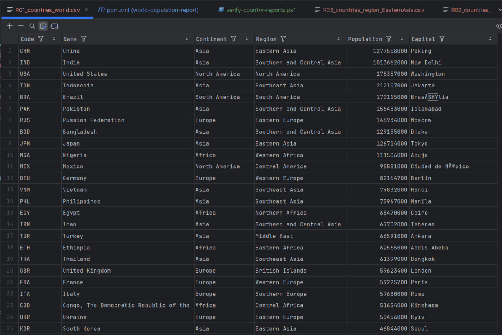                                         | [R01_countries_world.csv](docs/evidence/R01_countries_world.csv)                         |
| R02 | All the countries in a continent organised by largest population to smallest.                  | ✅ Yes |                                 | [R02_countries_continent_Asia.csv](docs/evidence/R02_countries_continent_Asia.csv)       |
| R03 | All the countries in a region organised by largest population to smallest.                     | ✅ Yes | 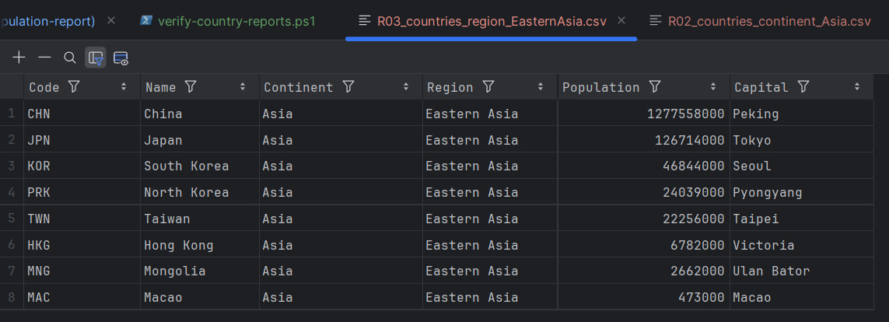                          | [R03_countries_region_WesternEurope.csv](docs/evidence/R03_countries_region_WesternEurope.csv) |
| R04 | The top N populated countries in the world where N is provided by the user.                    | ✅ Yes | 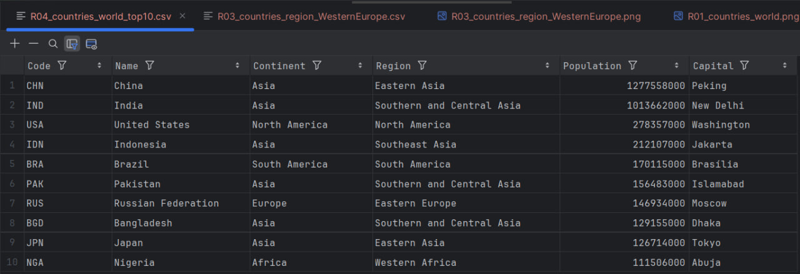                                   | [R04_countries_world_top10.csv](docs/evidence/R04_countries_world_top10.csv)             |
| R05 | The top N populated countries in a continent where N is provided by the user.                  | ✅ Yes | 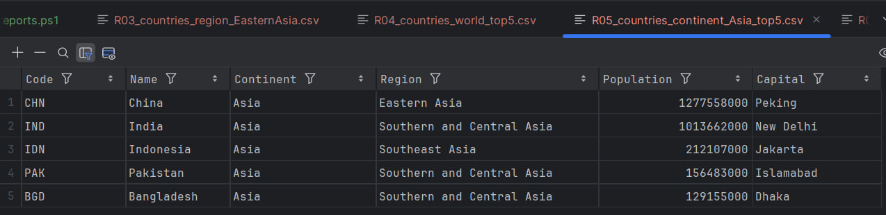                         | [R05_countries_continent_Europe_top5.csv](docs/evidence/R05_countries_continent_Europe_top5.csv) |
| R06 | The top N populated countries in a region where N is provided by the user.                     | ✅ Yes | 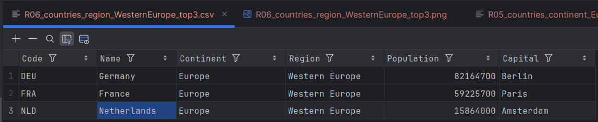                     | [R06_countries_region_WesternEurope_top3.csv](docs/evidence/R06_countries_region_WesternEurope_top3.csv) |
| R07 | All the cities in the world organised by largest population to smallest.                       | ✅ Yes |                                             | [R07_cities_world.csv](docs/evidence/R07_cities_world.csv)                               |
| R08 | All the cities in a continent organised by largest population to smallest.                     | ✅ Yes |                                    | [R08_cities_continent_Asia.csv](docs/evidence/R08_cities_continent_Asia.csv)             |
| R09 | All the cities in a region organised by largest population to smallest.                        | ✅ Yes | 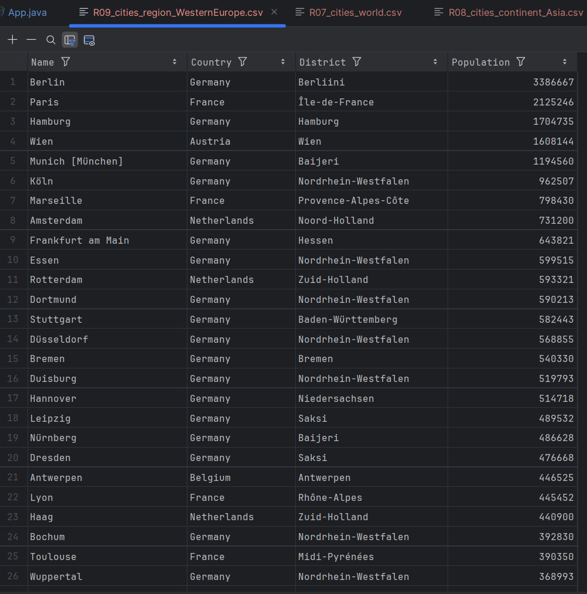                             | [R09_cities_region_WesternEurope.csv](docs/evidence/R09_cities_region_WesternEurope.csv) |
| R10 | All the cities in a country organised by largest population to smallest.                       | ✅ Yes | 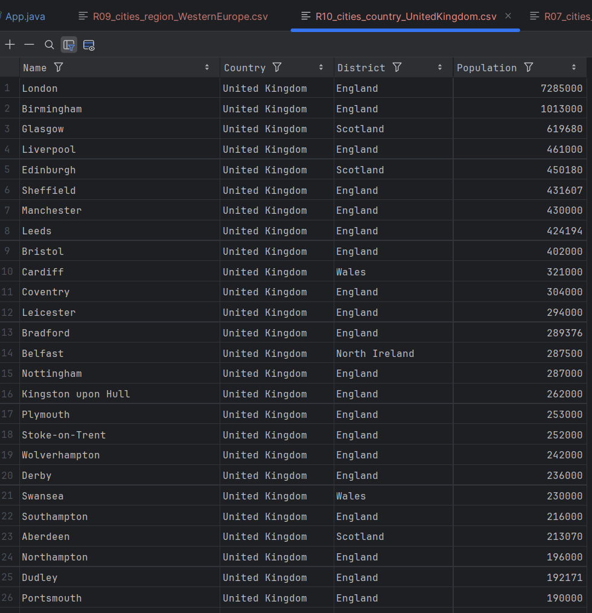                            | [R10_cities_country_UnitedKingdom.csv](docs/evidence/R10_cities_country_UnitedKingdom.csv) |
| R11 | All the cities in a district organised by largest population to smallest.                      | ✅ Yes | 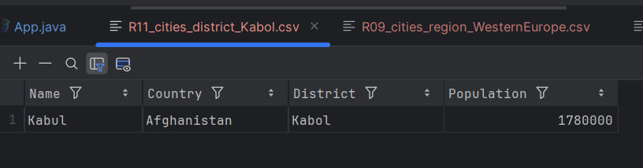                                   | [R11_cities_district_Kabol.csv](docs/evidence/R11_cities_district_Kabol.csv)             |
| R12 | The top N populated cities in the world where N is provided by the user.                       | ✅ Yes | 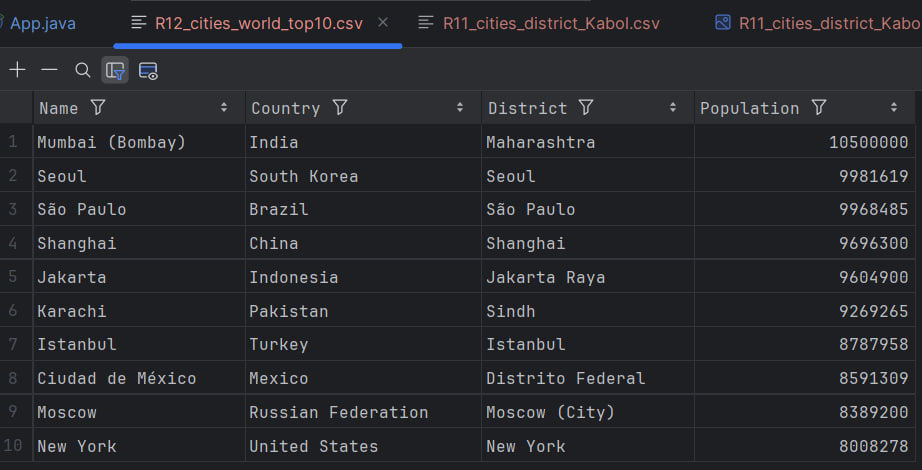                                      | [R12_cities_world_top10.csv](docs/evidence/R12_cities_world_top10.csv)                   |
| R13 | The top N populated cities in a continent where N is provided by the user.                     | ✅ Yes | 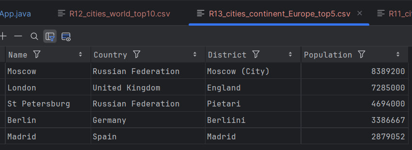                            | [R13_cities_continent_Europe_top5.csv](docs/evidence/R13_cities_continent_Europe_top5.csv) |
| R14 | The top N populated cities in a region where N is provided by the user.                        | ✅ Yes | 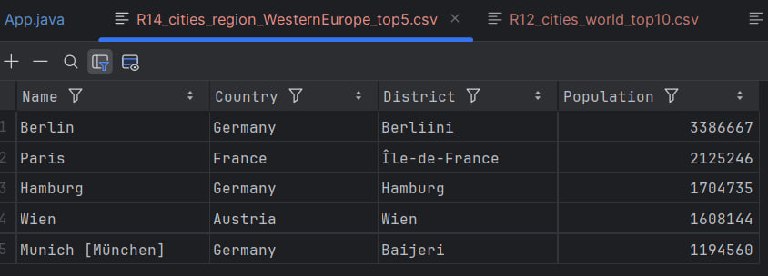                        | [R14_cities_region_WesternEurope_top5.csv](docs/evidence/R14_cities_region_WesternEurope_top5.csv) |
| R15 | The top N populated cities in a country where N is provided by the user.                       | ✅ Yes | 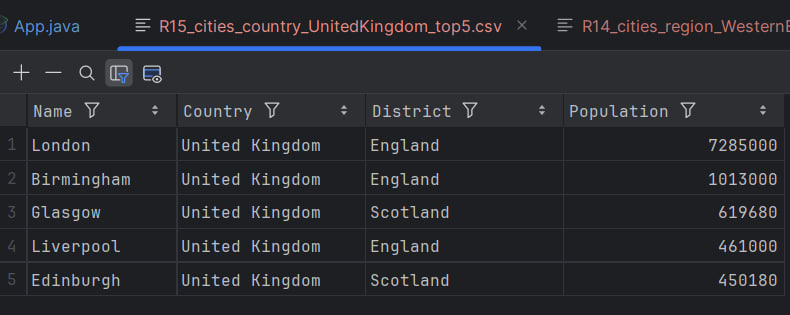                       | [R15_cities_country_UnitedKingdom_top5.csv](docs/evidence/R15_cities_country_UnitedKingdom_top5.csv) |
| R16 | The top N populated cities in a district where N is provided by the user.                      | ✅ Yes | 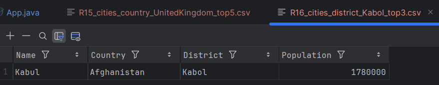                              | [R16_cities_district_Kabol_top3.csv](docs/evidence/R16_cities_district_Kabol_top3.csv)   |
| R17 | All the capital cities in the world organised by largest population to smallest.               | ✅ Yes |                                           | [R17_capitals_world.csv](docs/evidence/R17_capitals_world.csv)                           |
| R18 | All the capital cities in a continent organised by largest population to smallest.             | ✅ Yes | 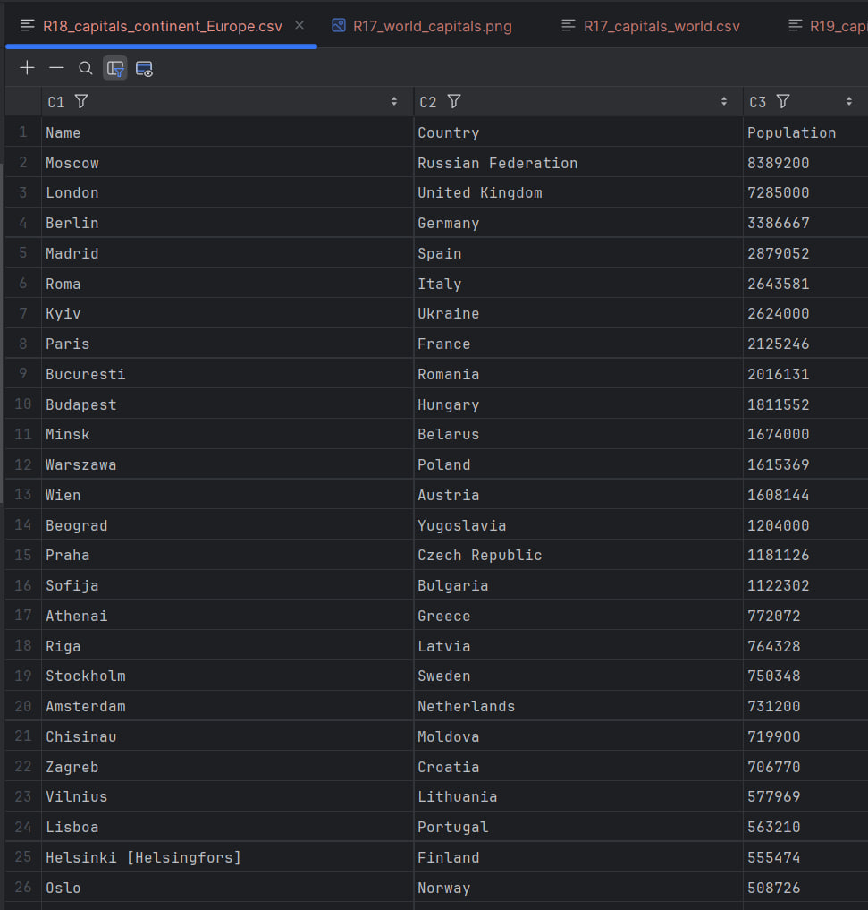                               | [R18_capitals_continent_Europe.csv](docs/evidence/R18_capitals_continent_Europe.csv)     |
| R19 | All the capital cities in a region organised by largest population to smallest.                | ✅ Yes | 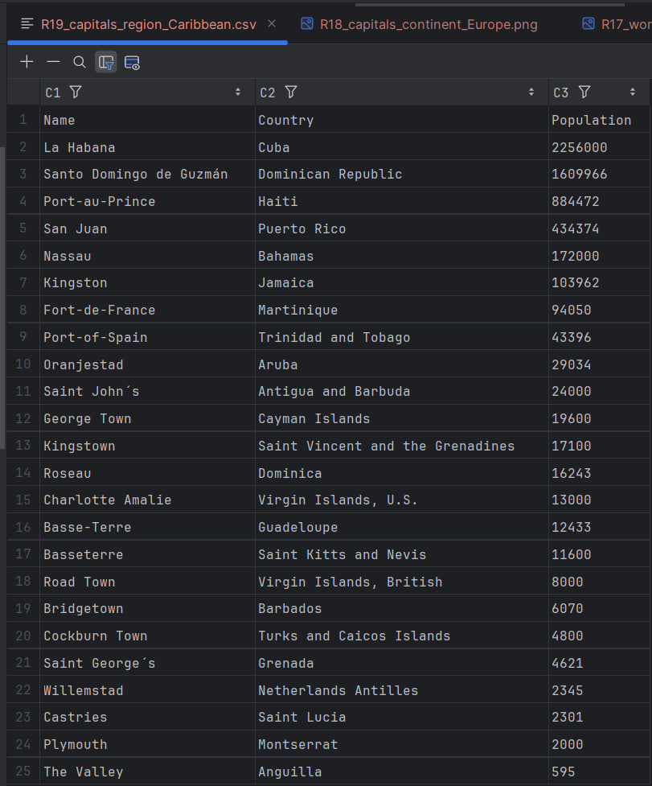                               | [R19_capitals_region_Caribbean.csv](docs/evidence/R19_capitals_region_Caribbean.csv)     |
| R20 | The top N populated capital cities in the world where N is provided by the user.               | ✅ Yes | 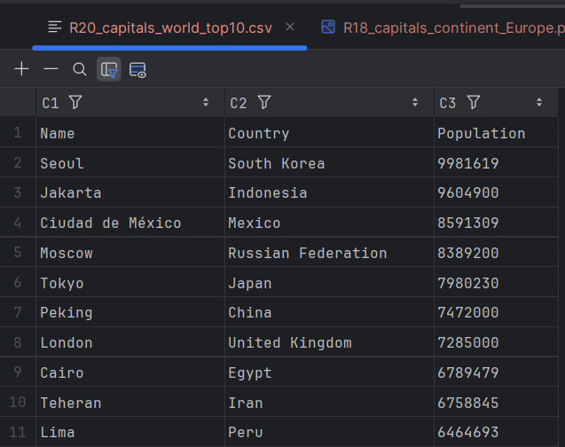                                    | [R20_capitals_world_top10.csv](docs/evidence/R20_capitals_world_top10.csv)               |
| R21 | The top N populated capital cities in a continent where N is provided by the user.             | ✅ Yes | 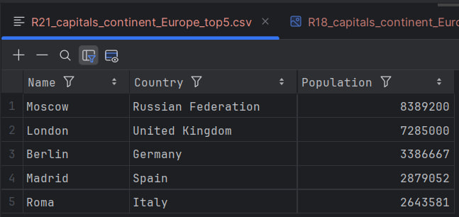                          | [R21_capitals_continent_Europe_top5.csv](docs/evidence/R21_capitals_continent_Europe_top5.csv) |
| R22 | The top N populated capital cities in a region where N is provided by the user.                | ✅ Yes | 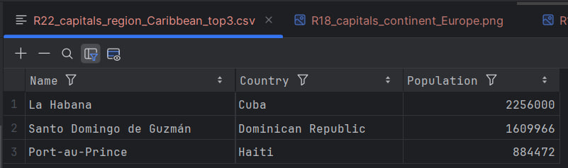                          | [R22_capitals_region_Caribbean_top3.csv](docs/evidence/R22_capitals_region_Caribbean_top3.csv) |
| R23 | Population of people, in cities and not in cities, for each continent.                         | ✅ Yes | 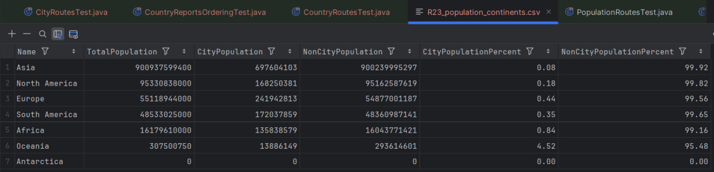                                   | [R23_population_continents.csv](docs/evidence/R23_population_continents.csv)             |
| R24 | Population of people, in cities and not in cities, for each region.                            | ✅ Yes | 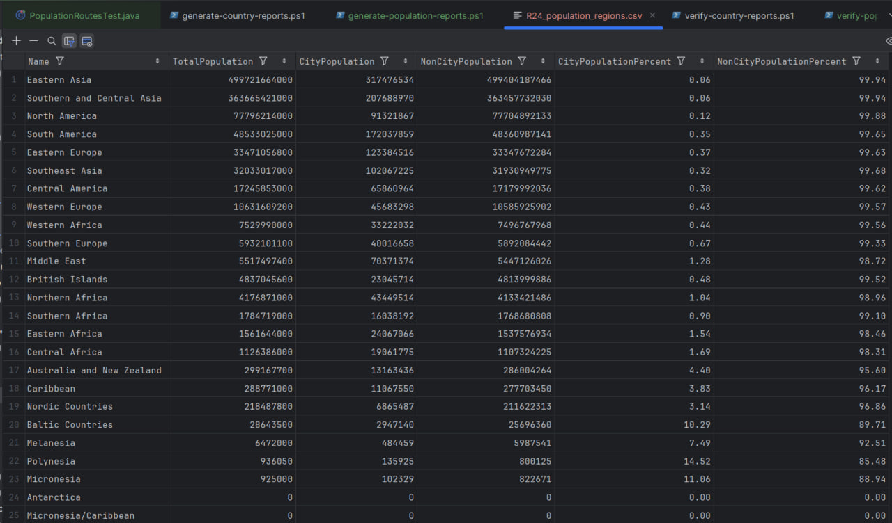                                      | [R24_population_regions.csv](docs/evidence/R24_population_regions.csv)                   |
| R25 | Population of people, in cities and not in cities, for each country.                           | ✅ Yes | 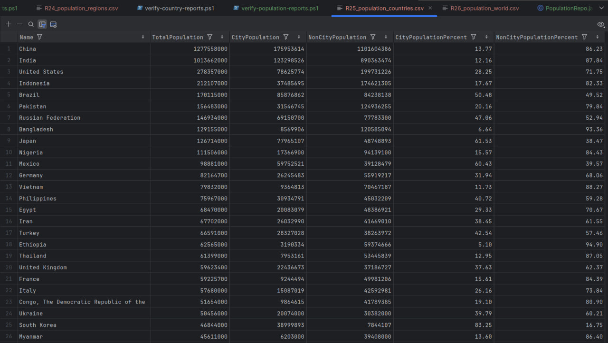                                    | [R25_population_countries.csv](docs/evidence/R25_population_countries.csv)               |
| R26 | The population of the world.                                                                   | ✅ Yes | 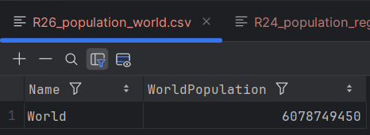                                        | [R26_population_world.csv](docs/evidence/R26_population_world.csv)                       |
| R27 | The population of a continent.                                                                 | ✅ Yes | 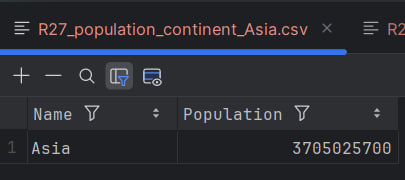                               | [R27_population_continent_Asia.csv](docs/evidence/R27_population_continent_Asia.csv)     |
| R28 | The population of a region.                                                                    | ✅ Yes | 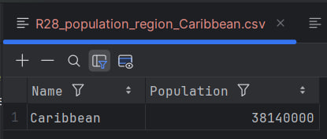                             | [R28_population_region_Caribbean.csv](docs/evidence/R28_population_region_Caribbean.csv) |
| R29 | The population of a country.                                                                   | ✅ Yes | 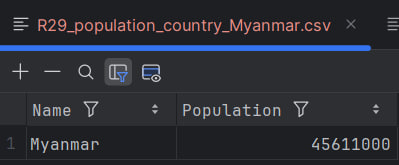                              | [R29_population_country_Myanmar.csv](docs/evidence/R29_population_country_Myanmar.csv)   |
| R30 | The population of a district.                                                                  | ✅ Yes | 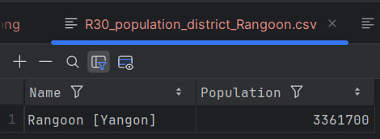                             | [R30_population_district_Rangoon.csv](docs/evidence/R30_population_district_Rangoon.csv) |
| R31 | The population of a city.                                                                      | ✅ Yes | 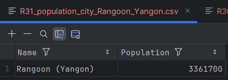                          | [R31_population_city_Rangoon_Yangon.csv](docs/evidence/R31_population_city_Rangoon_Yangon.csv) |
| R32 | Number of people who speak Chinese, English, Hindi, Spanish, and Arabic, with world % shares. | ✅ Yes | 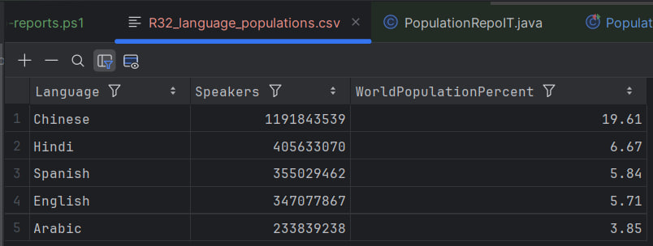                                    | [R32_language_populations.csv](docs/evidence/R32_language_populations.csv)               |

---


## Assessment Evidence (CR1 / CR2 / Final)

### CR1 — Checklist

| ID | Criterion (Rubric)                                  | Met | Evidence (path / note)                                      |
|----|-----------------------------------------------------|-----|-------------------------------------------------------------|
| 1  | GitHub project set-up                               | ✅  | Screenshot of repo root in `docs/evidence/`                 |
| 2  | Product Backlog created                             | ✅  | Issues / project board screenshot                           |
| 3  | Builds to self-contained JAR with Maven             | ✅  | `target/world-population-report.jar`                        |
| 4  | Dockerfile set-up and works                         | ✅  | `docker-compose.yml` + compose PowerShell output            |
| 5  | GitHub Actions build using JAR & Docker             | ✅  | CI run screenshot                                           |
| 6  | GitFlow branches (`master`, `develop`, `release/*`) | ✅  | Branches screenshot                                         |
| 7  | First release created                               | ✅  | GitHub Releases screenshot                                  |
| 8  | Code of Conduct defined                             | ✅  | `CODE_OF_CONDUCT.md`                                        |
| 9  | Issues used on GitHub                               | ✅  | Issues / backlog screenshot                                 |
| 10 | Tasks defined as user stories                       | ✅  | Example user-story issues                                   |
| 11 | Project integrated with Zube.io                     | ✅  | Zube board screenshot                                       |
| 12 | Kanban / Project Board being used                   | ✅  | GitHub Project board screenshot                             |
| 13 | Sprint Boards being used                            | ✅  | Iteration / sprint view screenshot                          |
| 14 | Full use cases defined                              | ✅  | `docs/use-cases`                                            |
| 15 | Use case diagram created                            | ✅  | UML diagram in `docs/uml`                                   |


---
### CR2 — Graded Criteria

| ID | Criterion (Rubric)                                           | Met / Value | Evidence (path / note)                                  |
|----|--------------------------------------------------------------|-------------|---------------------------------------------------------|
| 1  | Quality & coverage of unit tests                             | ✅ (see % in JaCoCo) | JaCoCo report screenshot                           |
| 2  | Suitable integration tests defined                           | ✅           | `CountriesIT` passing, CI logs                          |
| 3  | Continuous integration running tests (GitHub Actions)        | ✅           | CI pipeline status                                      |
| 4  | Deployment working (Docker run + smoke)                      | ✅           | `docker compose up` + `curl` smoke-test screenshot      |
| 5  | Bug reporting system set-up                                  | ✅           | Issue / label screenshots                               |
| 6  | Badges (build master/develop, coverage, release, license)    | ✅           | This README header                                      |
| 7  | Project Requirements Met (R01–R32)                            | **6 / 32**   | See **Functional Requirements** section                 |
| 8  | Correct use of GitHub & Kanban; commit frequency; comments   | ✅           | Insights / commit history screenshots                   |


---
### Final — Delivery Checklist

| ID | Item (assessed on master)                                        | Met | Evidence (path / note)                          |
|----|------------------------------------------------------------------|-----|-------------------------------------------------|
| 1  | README contains all required badges                              | ✅  | This file                                       |
| 2  | Evidence table for requirements R01–R32 present                  | ✅  | See **Functional Requirements** section         |
| 3  | Master branch contains assessable code (builds & runs)           | ✅  | `mvn test` + manual run                         |
| 4  | Final release/tag created                                        | ✅  | GitHub Releases                                 |
| 5  | Individual contribution spreadsheet submitted (CR1 & CR2)        | ✅  | Submitted separately via Moodle                 |


---
## Team

This is a **Group 13** submission for **SET09803**.

The full team roster (names, student numbers and GitHub usernames) is listed in
[`TEAM.md`](TEAM.md).

> Individual contribution percentages for **Code Review 1 (CR1)**,  
> **Code Review 2 (CR2)** and the **Final Delivery** are recorded in the
> official contribution spreadsheets submitted via Moodle, as required by the
> module handbook. GitHub commit and pull-request history provides additional
> evidence of each member’s contribution.

---
## License

This project is released under the **MIT License**.

See `LICENSE` for details.
---

