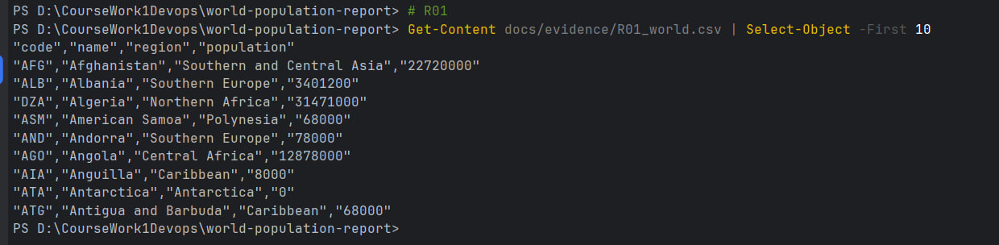
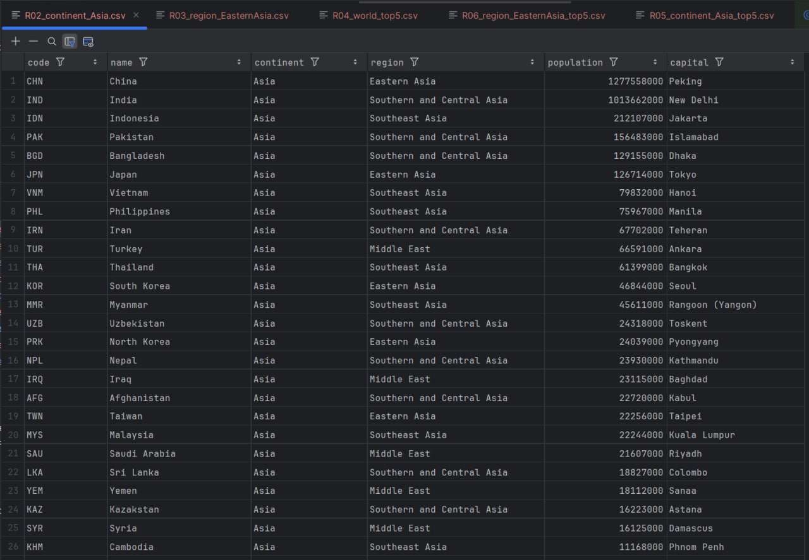
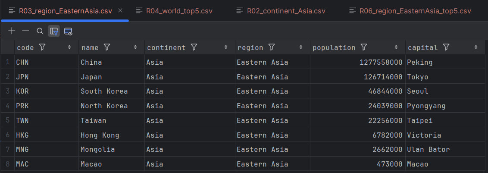
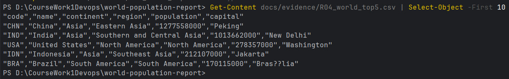
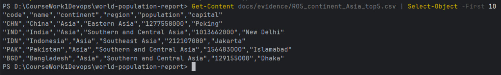
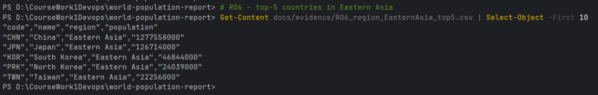

# World Population Report (SET09803 – Group 13)

<p align="left">
  <!-- CI (GitFlow branches) -->
  <a href="https://github.com/napier-devops-group13/world-population-report/actions/workflows/ci.yml?query=branch%3Amaster">
    
  </a>
  <a href="https://github.com/napier-devops-group13/world-population-report/actions/workflows/ci.yml?query=branch%3Adevelop">
    
  </a>

  <!-- Coverage (master) -->
  <a href="https://app.codecov.io/gh/napier-devops-group13/world-population-report">
    
  </a>

  <!-- Release + License + Tech -->
  <a href="https://github.com/napier-devops-group13/world-population-report/releases/latest">
    
  </a>

  <a href="LICENSE">
    
  </a>
  
  
</p>

REST API coursework for **SET09803** using the classic MySQL **`world`** dataset.  
The project is built to be **CI-friendly**, **Dockerised**, and aligned with the **Code Review 1**, **Code Review 2**, and **Final Delivery** marking criteria.

Currently the project:

- Implements the **Country Reports R01–R06** end-to-end (SQL ➜ Javalin ➜ JSON ➜ CSV evidence).
- Provides a reproducible stack using **Docker Compose** (MySQL 8.4 + app).
- Runs via **Maven** with unit + integration tests, JaCoCo coverage, Checkstyle and SpotBugs.
- Integrates with **GitHub Actions** (build, tests, coverage upload, Docker smoke test).
- Uses a **GitFlow**-style workflow (`master`, `develop`, `release/*`) with PR templates, issue templates, CODEOWNERS and a Code of Conduct.

---

## Table of Contents

- [Quick Start](#quick-start)
- [API Endpoints — Countries (R01–R06)](#api-endpoints--countries-r01r06)
- [Report Evidence for R01–R06](#report-evidence-for-r01r06)
- [Database & Seeding](#database--seeding)
- [Project Structure](#project-structure)
- [Quality & CI/CD](#quality--cicd)
- [Functional Requirements (R01–R32)](#functional-requirements-r01r32)
- [Assessment Evidence (CR1 / CR2 / Final)](#assessment-evidence-cr1--cr2--final)
- [Team](#team)
- [License](#license)

---

## Quick Start

> **Requirements:** JDK 21+, Maven 3.9+, Docker Desktop

### Option A — Full stack via Docker Compose (recommended for demo)

```bash
# from repo root
docker compose up -d
# db  -> MySQL 8.4 with 'world' schema
# app -> Javalin API on http://localhost:7070
```
---
## API Endpoints — Countries (R01–R06)

**Base URL:** `http://localhost:7070`

| ID  | Method | Endpoint                                       | Description                                      |
|-----|--------|------------------------------------------------|--------------------------------------------------|
| R01 | GET    | `/countries/world`                            | All countries in the world                       |
| R02 | GET    | `/countries/continent/{continent}`            | All countries in a continent                     |
| R03 | GET    | `/countries/region/{region}`                  | All countries in a region                        |
| R04 | GET    | `/countries/world/top/{n}`                    | Top-N countries in the world by population       |
| R05 | GET    | `/countries/continent/{continent}/top/{n}`    | Top-N countries in a continent by population     |
| R06 | GET    | `/countries/region/{region}/top/{n}`          | Top-N countries in a region by population        |

**Error handling (examples):**

- `n <= 0` or non-integer → **HTTP 400** JSON error (e.g. `{"error":"n must be > 0"}`).
- Unknown continent/region → **400/404** depending on repository lookup.
---
## Database & Seeding

- **Image:** `mysql:8.4`
- **Service name (compose):** `db`
- **Schema:** classic *world* dataset.
- **Seed file:** `db/init/01-world.sql` mounted into the container.

`docker-compose.yml` exposes:

- MySQL container port `3306` → host port `43306` (or similar).
- App container port `7070` → host port `7070`.

## Application database configuration

Defaults for local development are in `src/main/resources/application.properties`:

```properties
port=7070

DB_HOST=localhost
DB_PORT=43306
DB_NAME=world
DB_USER=app
DB_PASS=app
```
---
## Project Structure

| Path                                                         | Purpose                                                   |
|--------------------------------------------------------------|-----------------------------------------------------------|
| `src/main/java/com/group13/population/App.java`              | Javalin bootstrap + route wiring for **R01–R06**         |
| `src/main/java/com/group13/population/db/Db.java`            | MySQL connection utilities + `awaitReady()`              |
| `src/main/java/com/group13/population/repo/WorldRepo.java`   | SQL queries and mappers for country reports              |
| `src/test/java/com/group13/population/SanityTest.java`       | Sanity/ordering tests on country data                    |
| `src/test/java/com/group13/population/CountriesIT.java`      | Integration tests hitting the real database              |
| `db/init/01-world.sql`                                       | Seed data for MySQL `world` schema                       |
| `Dockerfile`                                                 | Multi-stage build for a small runnable image             |
| `docker-compose.yml`                                         | Local stack: `db` + `app` services                       |
| `pom.xml`                                                    | Maven config (shaded JAR, surefire/failsafe, JaCoCo, Checkstyle, SpotBugs) |
| `.github/workflows/ci.yml`                                   | GitHub Actions pipeline (build, tests, coverage, Docker smoke) |
---
## Quality & CI/CD

- **CI triggers on:** pushes and PRs to `master`, `develop`, and `release/*`.

- **Build & test:**
  - Uses JDK 24 in CI.
  - Spins up a MySQL service and seeds the `world` DB.
  - Runs unit tests and integration tests (Failsafe).
  - Publishes the shaded JAR as an artifact.

- **Coverage:**
  - JaCoCo is run during CI.
  - Coverage is uploaded to **Codecov**, surfacing in the README badge.

- **Static analysis:**
  - Checkstyle (Google config) and SpotBugs run as part of the Maven build.

- **Docker smoke test:**
  - Builds the Docker image for the app.
  - Runs the container against a MySQL service.
  - Verifies `GET /countries/world` returns `200`.
---
## Functional Requirements (R01–R32)

## Summary of the coursework functional requirements and current implementation status

> **Count:** 6 / 32 requirements implemented (all **Country** reports R01–R06) → **18.75%**.

| ID  | Name                                           | Met      | Evidence / Screenshot                                                                                                                                                           |
|-----|------------------------------------------------|:--------:|---------------------------------------------------------------------------------------------------------------------------------------------------------------------------------|
| R01 | All countries in the world                     | ✅ Yes   | [R01_world.csv](docs/evidence/R01_world.csv) ·                                                        |
| R02 | All countries in a continent                   | ✅ Yes   | [R02_continent_Asia.csv](docs/evidence/R02_continent_Asia.csv) ·                             |
| R03 | All countries in a region                      | ✅ Yes   | [R03_region_EasternAsia.csv](docs/evidence/R03_region_EasternAsia.csv) ·                 |
| R04 | Top-N countries in the world                   | ✅ Yes   | [R04_world_top5.csv](docs/evidence/R04_world_top5.csv) ·                                         |
| R05 | Top-N countries in a continent                 | ✅ Yes   | [R05_continent_Asia_top5.csv](docs/evidence/R05_continent_Asia_top5.csv) ·              |
| R06 | Top-N countries in a region                    | ✅ Yes   | [R06_region_EasternAsia_top5.csv](docs/evidence/R06_region_EasternAsia_top5.csv) ·  |
| R07 | All cities in the world                        | ❌ No    | –                                                                                                                                                                               |
| R08 | All cities in a continent                      | ❌ No    | –                                                                                                                                                                               |
| R09 | All cities in a region                         | ❌ No    | –                                                                                                                                                                               |
| R10 | All cities in a country                        | ❌ No    | –                                                                                                                                                                               |
| R11 | All cities in a district                       | ❌ No    | –                                                                                                                                                                               |
| R12 | Top-N cities in the world                      | ❌ No    | –                                                                                                                                                                               |
| R13 | Top-N cities in a continent                    | ❌ No    | –                                                                                                                                                                               |
| R14 | Top-N cities in a region                       | ❌ No    | –                                                                                                                                                                               |
| R15 | Top-N cities in a country                      | ❌ No    | –                                                                                                                                                                               |
| R16 | Top-N cities in a district                     | ❌ No    | –                                                                                                                                                                               |
| R17 | All capital cities in the world                | ❌ No    | –                                                                                                                                                                               |
| R18 | All capital cities in a continent              | ❌ No    | –                                                                                                                                                                               |
| R19 | All capital cities in a region                 | ❌ No    | –                                                                                                                                                                               |
| R20 | Top-N capital cities in the world              | ❌ No    | –                                                                                                                                                                               |
| R21 | Top-N capital cities in a continent            | ❌ No    | –                                                                                                                                                                               |
| R22 | Top-N capital cities in a region               | ❌ No    | –                                                                                                                                                                               |
| R23 | Population in & out of cities per continent    | ❌ No    | –                                                                                                                                                                               |
| R24 | Population in & out of cities per region       | ❌ No    | –                                                                                                                                                                               |
| R25 | Population in & out of cities per country      | ❌ No    | –                                                                                                                                                                               |
| R26 | Population of the world                        | ❌ No    | –                                                                                                                                                                               |
| R27 | Population of a continent                      | ❌ No    | –                                                                                                                                                                               |
| R28 | Population of a region                         | ❌ No    | –                                                                                                                                                                               |
| R29 | Population of a country                        | ❌ No    | –                                                                                                                                                                               |
| R30 | Population of a district                       | ❌ No    | –                                                                                                                                                                               |
| R31 | Population of a city                           | ❌ No    | –                                                                                                                                                                               |
| R32 | Language statistics (Chinese, English, Hindi, Spanish, Arabic) | ❌ No | –                                                                                                                                                                               |

---
## Assessment Evidence (CR1 / CR2 / Final)

### CR1 — Checklist

| ID | Criterion (Rubric)                                  | Met | Evidence (path / note)                                      |
|----|-----------------------------------------------------|-----|-------------------------------------------------------------|
| 1  | GitHub project set-up                               | ✅  | Screenshot of repo root in `docs/evidence/`                 |
| 2  | Product Backlog created                             | ✅  | Issues / project board screenshot                           |
| 3  | Builds to self-contained JAR with Maven             | ✅  | `target/world-population-report.jar`                        |
| 4  | Dockerfile set-up and works                         | ✅  | `docker-compose.yml` + compose PowerShell output            |
| 5  | GitHub Actions build using JAR & Docker             | ✅  | CI run screenshot                                           |
| 6  | GitFlow branches (`master`, `develop`, `release/*`) | ✅  | Branches screenshot                                         |
| 7  | First release created                               | ✅  | GitHub Releases screenshot                                  |
| 8  | Code of Conduct defined                             | ✅  | `CODE_OF_CONDUCT.md`                                        |
| 9  | Issues used on GitHub                               | ✅  | Issues / backlog screenshot                                 |
| 10 | Tasks defined as user stories                       | ✅  | Example user-story issues                                   |
| 11 | Project integrated with Zube.io                     | ✅  | Zube board screenshot                                       |
| 12 | Kanban / Project Board being used                   | ✅  | GitHub Project board screenshot                             |
| 13 | Sprint Boards being used                            | ✅  | Iteration / sprint view screenshot                          |
| 14 | Full use cases defined                              | ✅  | `docs/use-cases`                                            |
| 15 | Use case diagram created                            | ✅  | UML diagram in `docs/uml`                                   |
---
### CR2 — Graded Criteria

| ID | Criterion (Rubric)                                           | Met / Value | Evidence (path / note)                                  |
|----|--------------------------------------------------------------|-------------|---------------------------------------------------------|
| 1  | Quality & coverage of unit tests                             | ✅ (see % in JaCoCo) | JaCoCo report screenshot                           |
| 2  | Suitable integration tests defined                           | ✅           | `CountriesIT` passing, CI logs                          |
| 3  | Continuous integration running tests (GitHub Actions)        | ✅           | CI pipeline status                                      |
| 4  | Deployment working (Docker run + smoke)                      | ✅           | `docker compose up` + `curl` smoke-test screenshot      |
| 5  | Bug reporting system set-up                                  | ✅           | Issue / label screenshots                               |
| 6  | Badges (build master/develop, coverage, release, license)    | ✅           | This README header                                      |
| 7  | Project Requirements Met (R01–R32)                            | **6 / 32**   | See **Functional Requirements** section                 |
| 8  | Correct use of GitHub & Kanban; commit frequency; comments   | ✅           | Insights / commit history screenshots                   |
---
### Final — Delivery Checklist

| ID | Item (assessed on master)                                        | Met | Evidence (path / note)                          |
|----|------------------------------------------------------------------|-----|-------------------------------------------------|
| 1  | README contains all required badges                              | ✅  | This file                                       |
| 2  | Evidence table for requirements R01–R32 present                  | ✅  | See **Functional Requirements** section         |
| 3  | Master branch contains assessable code (builds & runs)           | ✅  | `mvn test` + manual run                         |
| 4  | Final release/tag created                                        | ✅  | GitHub Releases                                 |
| 5  | Individual contribution spreadsheet submitted (CR1 & CR2)        | ✅  | Submitted separately via Moodle                 |
---
## Team

This is a **Group 13** submission for SET09803.  
The full team roster is listed in `TEAM.md`.

> Individual contribution percentages for CR1 and CR2 are recorded in the official spreadsheets submitted via Moodle (as required by the module handbook).
---
## License

This project is released under the **MIT License**.

See `LICENSE` for details.
---

